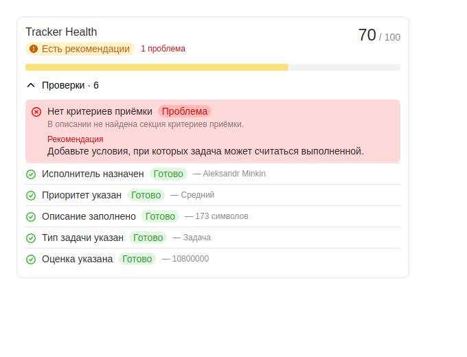
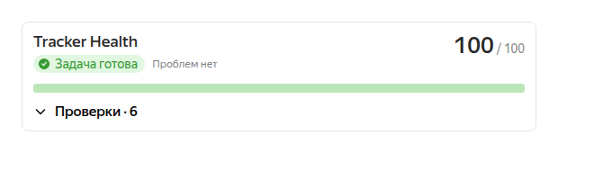
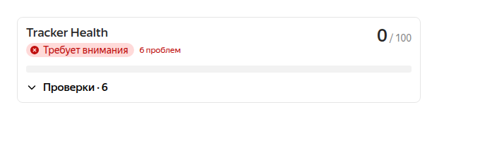

<p align="center">
  
</p>

<h1 align="center">Tracker Health</h1>

<p align="center">
  Quality gate для задач Yandex Tracker.<br>
  Показывает готовность задачи к работе и объясняет, что нужно исправить.
</p>

<p align="center">
  <a href="https://github.com/minkinad/yc-tracker-plugin-tracker-health/actions/workflows/ci.yml"></a>
  
  <a href="https://yandex.ru/support/tracker/ru/plugins/"></a>
  <a href="https://yandex.ru/support/tracker/ru/plugins/tools/"></a>
  
  <a href="./LICENSE"></a>
</p>

Tracker Health анализирует текущую задачу прямо в `issue.block`, рассчитывает Health Score от 0 до 100 и показывает конкретные рекомендации до начала работы.

Версия 0.1 работает полностью внутри плагина: не использует ИИ, не отправляет данные на внешний сервер и не требует отдельной базы данных.

## Как выглядит

Скриншоты собраны из текущих компонентов v0.1 на детерминированных данных. В Yandex Tracker блок использует тему хоста и автоматически подстраивается под доступную ширину.

### Задаче нужны улучшения

Проблемные проверки показываются первыми. Детали и рекомендация доступны в компактной раскрываемой секции.

<p align="center">
  
</p>

<table>
  <tr>
    <td width="50%">
      <strong>Задача готова</strong><br><br>
      Все шесть проверок пройдены.<br><br>
      
    </td>
    <td width="50%">
      <strong>Требует внимания</strong><br><br>
      Ни одна обязательная проверка не пройдена.<br><br>
      
    </td>
  </tr>
</table>

## Проблема

Задачи часто уходят в работу без исполнителя, оценки, нормального описания или критериев приёмки. Недостающая информация обнаруживается уже после старта и создаёт лишние уточнения, ожидание и переделки.

Tracker Health делает качество оформления видимым заранее:

- анализирует текущую задачу;
- рассчитывает единый Health Score;
- показывает количество найденных проблем;
- объясняет причину каждой проваленной проверки;
- даёт короткую рекомендацию по исправлению.

## Возможности v0.1

- Работа в слотах `issue.block` и `drawer.issue.block`.
- Шесть детерминированных правил с суммарным весом 100.
- Уровни `healthy`, `warning` и `critical` с текстом и иконкой.
- Компактные пройденные проверки и повышенный визуальный приоритет проблемных проверок.
- Раскрываемый список правил для экономии места в карточке задачи.
- Состояния загрузки, ошибки и повторного анализа.
- Error Boundary, не позволяющий ошибке плагина сломать интерфейс хоста.
- Светлая, тёмная и высококонтрастные темы через тему Yandex Tracker.
- Чистый доменный слой без React и Tracker SDK.

## Как это работает

```text
Tracker SDK
    ↓
Infrastructure Adapter
    ↓
Domain Health Engine
    ↓
UI
```

1. Tracker Plugin SDK передаёт текущую задачу через контекст слота уровня `full`.
2. Infrastructure Adapter проверяет неизвестные и nullable-значения SDK.
3. `mapTrackerIssueToHealthContext()` преобразует задачу в независимую доменную модель.
4. `evaluateIssueHealth()` запускает правила и рассчитывает результат.
5. React-компоненты только отображают готовый `IssueHealthResult`.

Лишних запросов к Tracker API нет: основной анализ использует контекст слота. Документированный `hostApi.getContext()` вызывается только при ручном повторе после ошибки.

## Health Score

В расчёте участвуют только применимые правила. Проверки со статусом `skipped` исключаются из `totalWeight`.

```text
score = round(passedWeight / totalWeight × 100)
```

Если применимых правил нет, движок возвращает конечный score `0` без `NaN` или `Infinity`.

| Оценка | Уровень    | Статус в интерфейсе |
| -----: | ---------- | ------------------- |
| 90–100 | `healthy`  | Задача готова       |
|  70–89 | `warning`  | Есть рекомендации   |
|   0–69 | `critical` | Требует внимания    |

Цвет не является единственным индикатором: каждый уровень и результат правила сопровождаются текстом и иконкой.

## Правила по умолчанию

| Rule ID               | Условие                                                             | Вес |
| --------------------- | ------------------------------------------------------------------- | --: |
| `assignee`            | Исполнитель существует.                                             |  15 |
| `priority`            | Приоритет существует.                                               |  10 |
| `description`         | Описание после `trim()` содержит не менее 100 символов.             |  20 |
| `issue-type`          | Тип задачи существует.                                              |  10 |
| `estimate`            | Оценка существует и больше нуля.                                    |  15 |
| `acceptance-criteria` | В описании присутствует поддерживаемый заголовок критериев приёмки. |  30 |

Правило `acceptance-criteria` регистронезависимо распознаёт Markdown-заголовки и обычные заголовки с двоеточием:

```text
## Acceptance Criteria
### Критерии приёмки
Критерии приемки:
Критерии готовности:
```

Случайное упоминание этих слов внутри предложения не считается секцией. v0.1 проверяет наличие заголовка, но не пытается оценивать смысл или качество текста.

## Архитектура

| Слой                         | Ответственность                                             |
| ---------------------------- | ----------------------------------------------------------- |
| `src/app`                    | Координация анализа и обработка ошибок.                     |
| `src/infrastructure/tracker` | Проверка и преобразование данных Yandex Tracker.            |
| `src/domain/health`          | Контракты, правила и чистый Health Engine.                  |
| `src/components`             | Небольшие компоненты представления на Gravity UI.           |
| `src/shared`                 | Общие технические утилиты без продуктовой логики.           |
| `tests`                      | Тесты доменного, инфраструктурного, прикладного и UI-слоёв. |

Главная граница проекта:

```text
Yandex Tracker → infrastructure → domain → UI

domain ↛ React
domain ↛ Tracker SDK
domain ↛ browser / network / storage
```

Полные контракты, ограничения и Definition of Done описаны в [docs/ARCHITECTURE.md](docs/ARCHITECTURE.md).

## Приватность и границы v0.1

Tracker Health анализирует только данные открытой задачи, уже переданные плагину через slot context.

В текущей версии:

- нет собственной серверной части;
- нет внешних сетевых запросов;
- нет постоянного хранилища, `localStorage` или `storageApi`;
- нет базы данных;
- нет обработки с помощью ИИ или ML;
- нет автоматического изменения задачи;
- нет аналитики очереди.

## Разработка

Требования:

- Node.js `>=22.12.0`;
- npm `10.9.2`;
- Tracker Plugin CLI для запуска внутри Yandex Tracker.

```bash
git clone https://github.com/minkinad/yc-tracker-plugin-tracker-health.git
cd yc-tracker-plugin-tracker-health
npm ci
npm run dev
```

Проверка проекта и запуск отладочной сессии:

```bash
weavix doctor
weavix debug
```

Обычный запуск Vite вне Tracker не предоставляет реальный контекст `issue.block`. Для интеграционной проверки используйте отладочный процесс Tracker Plugin CLI.

## Тестирование

```bash
npm run lint
npm run typecheck
npm run test
npm run build
```

Режим наблюдения:

```bash
npm run test:watch
```

Основной приоритет тестов — доменный слой: расчёт score, пропущенные правила, границы уровней, неизменяемость входных данных и граничные случаи каждого правила. Отдельно покрыты mapper, ошибки анализа, повторный запуск и основные UI-состояния.

GitHub Actions запускает установку через lockfile, lint, typecheck, тесты и production build для каждого Pull Request и push в `main`.

## Статус проекта

`v0.1.0` — функционально завершённый первый релиз. Плагин пока не заявлен как опубликованный в публичном каталоге Yandex Tracker.

История изменений ведётся в [CHANGELOG.md](CHANGELOG.md).

## План развития

Следующие возможности запланированы и намеренно не входят в v0.1:

- **v0.2:** правила для отдельных очередей;
- **v0.3:** пользовательские поля и обязательные секции описания;
- **v0.4:** наборы правил по типу задачи;
- **v0.5:** сводная панель здоровья очереди;
- **v0.6:** аналитика устаревших и заблокированных задач;
- **v0.7:** импорт и экспорт конфигурации;
- **v0.8:** локализация;
- **v0.9:** подготовка к Marketplace;
- **v1.0:** публичный релиз.

## Участие в разработке

1. Создайте fork и отдельную ветку.
2. Установите зависимости через `npm ci`.
3. Не добавляйте зависимости доменного слоя от React или Tracker SDK.
4. Добавляйте поведенческие тесты для изменений правил, расчёта score или mapper.
5. Перед Pull Request выполните линтинг, проверку типов, тесты и сборку.

Сохраняйте Pull Request в границах текущего этапа. Для изменений, относящихся к будущим версиям, сначала создайте отдельное обсуждение или issue.

## Disclaimer

Tracker Health — это независимый проект с открытым исходным кодом,
не являющийся официальным продуктом Яндекса.

Yandex Tracker и связанные с ним товарные знаки принадлежат
их соответствующим владельцам.
